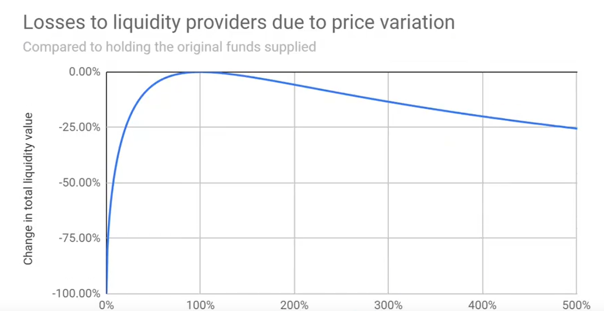

<!-- TOC -->
* [（一）理论知识梳理](#一理论知识梳理)
  * [一、代币税的核心作用与市场影响](#一代币税的核心作用与市场影响)
  * [二、常见代币税征收方式](#二常见代币税征收方式)
  * [三、税率调整与经济目标实现](#三税率调整与经济目标实现)
  * [四、风险与平衡要点](#四风险与平衡要点)
  * [结语](#结语)
* [SHIBDemo 代币合约操作指南](#shibdemo-代币合约操作指南)
  * [1. 合约部署](#1-合约部署)
    * [部署步骤](#部署步骤)
    * [部署后初始状态](#部署后初始状态)
  * [2. 代币交易操作](#2-代币交易操作)
    * [基本转账](#基本转账)
    * [转账限制规则](#转账限制规则)
  * [3. 添加流动性](#3-添加流动性)
    * [操作步骤](#操作步骤)
    * [添加流动性规则](#添加流动性规则)
  * [4. 移除流动性](#4-移除流动性)
    * [操作步骤](#操作步骤-1)
    * [移除规则](#移除规则)
  * [5. 查询功能](#5-查询功能)
    * [查询交易次数](#查询交易次数)
    * [查询流动性池状态](#查询流动性池状态)
    * [查询用户流动性](#查询用户流动性)
  * [6. 注意事项](#6-注意事项)
<!-- TOC -->


# （一）理论知识梳理


## 一、代币税的核心作用与市场影响
1. **价格稳定**
    - 通过增加短期交易成本抑制投机，减少价格波动（如Jager前14天10%交易税，奖励长期持有者并注入流动性池）。
    - 需依赖机制透明度：SafeMoon因虚假宣传导致信任崩塌，价格暴跌50%，反例证明透明度的重要性。

2. **流动性管理**
    - 税收定向补充流动性池，增强市场深度（如BURN币15%交易税中13.5%用于营销，形成正向循环）。
    - 动态调整税率可激活流动性：HODL将销毁税从7%降至1%后，价格飙升37%。
    - 无偿损失：价格上涨少赚钱，下个下跌多亏钱。损失跟价格关系见下图：
    - 

3. **稀缺性调控**
    - 交易税销毁机制减少流通量，支撑长期价值（如MEME币交易燃烧+递减空投，制造稀缺性预期）。


## 二、常见代币税征收方式

|税收类型|核心设计逻辑|典型案例|
| ---- | ---- | ---- |
|交易税|调节交易行为，分固定/动态/双向差异化税率|- 固定税率：SafeMoon（10%交易税，设计初衷为“自动做市”）<br>- 动态税率：Jager（10%→5%，初期抑投机，后期保流动）<br>- 双向差异：买入1%+卖出5%，通过“卖出惩罚”鼓励持有|
|持有税|引导长期持有，通过分层奖励筛选核心用户|- 时间阶梯税：PropiChain对长期持有者减免税收<br>- 分层奖励：Jager设置持仓门槛（1460亿JAGER），核心用户获3%-5%日均分红|
|销毁税|减少流通量，强化稀缺性预期|- 自动销毁：HODL通过降低销毁税（7%→1%）刺激市场<br>- 混合销毁：BURN币部分税收用于分红，部分间接通过销毁减少流通|


## 三、税率调整与经济目标实现
1. **抑制投机、稳定价格**
    - 短期高税率：Jager初期10%税率+锁仓机制，延缓抛售，转化投机者为中期持有者。
    - 透明化分配：HODL公开税收用途（50%捐赠+50%质押池），重建市场信任。

2. **激活流动性、扩大用户**
    - 阶梯式降税：BURN币从15%降至3%，初期积累流动性，后期降低交易摩擦吸引散户。
    - 流动性正反馈：Jager将未领空投注入流动性池，形成“流动性→收益→更多参与者”循环。

3. **激励社区、强化共识**
    - 分红门槛：Jager通过持仓门槛筛选核心支持者，高额分红激发护盘行为。
    - 价值捕获：Themis协议将25%交易费反哺质押者，增强长期持有者粘性。


## 四、风险与平衡要点
- **流动性陷阱**：高税收可能导致交易量萎缩（如SafeMoon丑闻后流动性枯竭），需动态调整税率或定向注入流动性。
- **合规性风险**：税收用途需链上可验证（如SafeMoon因不透明被SEC起诉）。
- **用户体验**：避免机制过度复杂（如Jager锁仓博弈抬高门槛），平衡规则设计与草根性。


## 结语
代币税是Meme代币的核心“调节器”，其效果取决于税率设计、透明度与预期管理。
动态税率、流动性定向注入与社区激励的结合可实现价格与流动性双赢，但需绑定治理与合规，方能推动Meme项目从“炒作符号”向“价值载体”进化。


#（二）实践操作

##合约开发
```solidity
// SPDX-License-Identifier: MIT
pragma solidity ^0.8.0;

import "@openzeppelin/contracts/token/ERC20/ERC20.sol";
import "@openzeppelin/contracts/token/ERC20/utils/SafeERC20.sol";
import "@openzeppelin/contracts/token/ERC20/extensions/ERC20Permit.sol";
import "@openzeppelin/contracts-upgradeable/security/ReentrancyGuardUpgradeable.sol";
import "@openzeppelin/contracts/utils/math/Sqrt.sol";
contract SHIBDemo is ERC20, ERC20Permit, ReentrancyGuardUpgradeable {
    using SafeERC20 for IERC20;

    // 核心常量定义
    uint256 public constant totalSupply = 1000000000000000 * 10**18;
    uint256 public constant maxTransferCount = 100000000 * 10**18;
    uint256 public constant dayTransferLimit = 3;
    uint256 public constant FEE_DENOMINATOR = 10000;
    uint256 public constant LIQUIDITY_FEE = 30;

    // 状态变量
    IERC20 public immutable pairedToken;
    ERC20 public immutable liquidityToken;
    mapping(address => mapping(uint256 => uint256)) public dailyTransferCount;
    mapping(address => uint256) public liquidityShares;
    uint256 public totalLiquidityShares;
    uint256 public immutable creationTime;

    // 事件定义
    event LiquidityAdded(address indexed provider, uint256 shibAmount, uint256 pairedTokenAmount, uint256 actualShib, uint256 actualPaired, uint256 shares);
    event LiquidityRemoved(address indexed provider, uint256 shibAmount, uint256 pairedTokenAmount, uint256 shares);

    constructor(address _pairedToken) ERC20("SHIBDemo", "SHIB") ERC20Permit("SHIBDemo") {
        pairedToken = IERC20(_pairedToken);
        liquidityToken = new ERC20("SHIB-LP", "SHIB-LP");
        _mint(msg.sender, totalSupply);
        creationTime = block.timestamp;
    }

    function burn(uint256 amount) external {
        super._burn(msg.sender, amount);
    }

    /**
     * @dev 重写ERC20的_transfer函数（核心转账逻辑，添加自定义规则）
     * @param from 转账发起地址（资金流出方）
     * @param to 转账接收地址（资金流入方）
     * @param amount 转账总金额（未扣除销毁和手续费的原始金额）
     * 核心功能：
     * 1. 限制单笔转账额度和每日转账次数（防大额波动和恶意刷量）
     * 2. 实现交易销毁机制（增强代币通缩性）
     * 3. 提取流动性手续费（自动注入流动性池，奖励做市商）
     * 执行流程：
     * - 先校验转账规则（额度、次数）
     * - 再计算销毁和手续费
     * - 最后分步骤执行销毁、手续费转账和实际转账
     */
    function _transfer(address from, address to, uint256 amount) internal override {
        // 校验1：单笔转账金额不得超过最大限制（防止大额交易冲击市场）
        // maxTransferCount为常量（如1亿枚），超过则转账失败
        require(amount <= maxTransferCount, "Transfer amount exceeds the daily limit");
        
        // 计算当前日期（按UTC时间，以天为单位：时间戳÷86400秒/天）
        uint256 currentDay = block.timestamp / 86400;
        
        // 校验2：非铸造场景（from≠0地址）需限制每日转账次数
        if (from != address(0)) { 
            // 验证当前地址今日交易次数是否小于限制（如3次/天）
            require(dailyTransferCount[from][currentDay] < dayTransferLimit, "Daily transfer limit exceeded");
            // 交易次数+1（记录本次转账，用于后续次数校验）
            dailyTransferCount[from][currentDay]++;
        }
        
        // 计算转账中的资金分配：
        // 1. 销毁金额：转账金额的0.1%（amount × 1/1000）
        uint256 burnAmount = amount * 1 / 1000;
        // 2. 流动性手续费：转账金额的0.3%（LIQUIDITY_FEE=30，FEE_DENOMINATOR=10000 → 30/10000=0.3%）
        uint256 liquidityFee = amount * LIQUIDITY_FEE / FEE_DENOMINATOR;
        
        // 步骤1：执行销毁（从发起者地址销毁对应金额，永久减少总供应量）
        super._burn(from, burnAmount);
        
        // 步骤2：转账手续费到流动性池（将手续费转入合约地址，作为流动性池储备）
        super._transfer(from, address(this), liquidityFee);
        
        // 步骤3：执行实际转账（将剩余金额转给接收方：总金额 - 销毁金额 - 手续费）
        super._transfer(from, to, amount - burnAmount - liquidityFee);
    }

    function getDailyTransferCount(address user, uint256 timestamp) external view returns (uint256) {
        uint256 day = timestamp / 86400;
        return dailyTransferCount[user][day];
    }

    // 核心优化：添加流动性函数（按比例校验+实际转移匹配量+退回超额）
    function addLiquidity(uint256 shibAmount, uint256 pairedTokenAmount) 
        external 
        nonReentrant 
        returns (uint256 shares) 
    {
        require(shibAmount > 0 && pairedTokenAmount > 0, "Cannot add zero liquidity");
        
        uint256 totalShib = balanceOf(address(this));
        uint256 totalPaired = pairedToken.balanceOf(address(this));
        
        // 定义实际注入量（后续根据比例调整）
        uint256 actualShib;
        uint256 actualPaired;

        if (totalLiquidityShares == 0) {
            // 首次添加：直接使用用户注入量（初始化比例）
            actualShib = shibAmount;
            actualPaired = pairedTokenAmount;
            // shares = actualShib; // 首次份额=注入的SHIB数量
             shares = Math.sqrt(actualShib * actualPaired); // 使用数学库计算几何平均数
        } else {
            // 非首次添加：计算应注入的配对代币数量
            uint256 requiredPairedAmount = (shibAmount * totalPaired) / totalShib;

            // 根据用户提供的数量确定实际注入量（匹配池内比例）
            if (pairedTokenAmount == requiredPairedAmount) {
                // 比例完全匹配：全量注入
                actualShib = shibAmount;
                actualPaired = pairedTokenAmount;
            } else if (pairedTokenAmount < requiredPairedAmount) {
                // 配对代币不足：按实际配对代币量反推SHIB注入量
                actualPaired = pairedTokenAmount;
                actualShib = (actualPaired * totalShib) / totalPaired;
            } else {
                // 配对代币超额：按SHIB注入量确定配对代币注入量
                actualShib = shibAmount;
                actualPaired = requiredPairedAmount;
            }
            // 根据实际注入量计算份额（因比例已匹配，两种方式结果一致）  用户获得的份额 = （用户注入的有效 SHIB 数量 ÷ 池内已有 SHIB 总量）× 池内现有总份额
            // 总池有 1000 SHIB + 100 USDT，总 shares 为 200 份。 此时： totalShib 是1000 SHIB   totalLiquidityShares是200
            // 用户注入 100 SHIB + 10 USDT（占总池的 10%），则获得 20 份 shares（占总 shares 的 10%）。  此时： actualShib 是100 SHIB
            // 这里的 “10% 占比” 是 “数量比例”（注入的 SHIB 占总 SHIB 的 10%，注入的 USDT 占总 USDT 的 10%）
            // 新资金注入会让老用户的 “相对占比” 下降，但 “绝对权益价值” 会随总池增长而水涨船高（除非资产价格下跌）。
            // 这和现实中 “投资基金” 的逻辑一致 —— 新资金进入会稀释老投资者的占比，但基金规模变大后，老投资者的资产也会跟着增值。
            // 后续有用户注入了以后，份额数量不变  但是占比变了  因为totalLiquidityShares变大了
            shares = (actualShib * totalLiquidityShares) / totalShib;
        }

        require(shares > 0, "Invalid liquidity amount");

        // 转移实际注入的SHIB（并退回超额部分）
        _transfer(msg.sender, address(this), actualShib);
        if (shibAmount > actualShib) {
            // 退回超额SHIB（从合约转回用户）
            _transfer(address(this), msg.sender, shibAmount - actualShib);
        }

        // 转移实际注入的配对代币（并退回超额部分）
        pairedToken.safeTransferFrom(msg.sender, address(this), actualPaired);
        if (pairedTokenAmount > actualPaired) {
            // 退回超额配对代币（从合约转回用户）
            pairedToken.safeTransfer(msg.sender, pairedTokenAmount - actualPaired);
        }

        // 更新份额记录
        liquidityShares[msg.sender] += shares;
        // totalLiquidityShares（总流动性份额）的值会随着用户向资金池注入流动性而增加。  是人为设定的 “权益计数基准”
        // 它本质是 “资金池所有流动性份额的总和”，新用户注入资产时会获得新的份额，因此总份额会累加。
        // 注入的人越多，总份额就越大，就像 “公司发行的股票总数” 会随着增发而增加一样。
        totalLiquidityShares += shares;

        // 发行LP代币（份额凭证）
        liquidityToken._mint(msg.sender, shares);

        // 触发事件（新增实际注入量参数，便于前端追踪）
        emit LiquidityAdded(msg.sender, shibAmount, pairedTokenAmount, actualShib, actualPaired, shares);
        return shares;
    }

    /**
     * @dev 移除流动性（核心功能：用户销毁LP份额，取回对应比例的两种代币）
     * @param shares 要销毁的流动性份额数量（用户需确保持有足够份额）
     * @return shibAmount 取回的SHIB代币数量（按份额比例计算）
     * @return pairedTokenAmount 取回的配对代币数量（按份额比例计算）
     * 安全特性：
     * - 非重入保护（nonReentrant）：防止恶意合约通过递归调用窃取资产
     * - 权限校验：确保用户持有足够份额，避免无效操作
     * 核心逻辑：
     * 1. 校验份额有效性（数量>0且用户持有量充足）
     * 2. 按份额占比计算可取回的两种代币数量
     * 3. 更新份额记录（减少用户个人份额和总份额）
     * 4. 销毁用户持有的LP代币（回收份额凭证）
     * 5. 将对应数量的代币转回用户地址
     */
    function removeLiquidity(uint256 shares) 
        external 
        nonReentrant 
        returns (uint256 shibAmount, uint256 pairedTokenAmount) 
    {
        // 校验份额有效性：必须大于0，且用户持有的份额不小于要销毁的数量
        require(shares > 0 && liquidityShares[msg.sender] >= shares, "Invalid share amount");
        
        // 获取当前流动性池中的两种代币储备量（用于计算取回数量）
        uint256 totalShib = balanceOf(address(this)); // 池内SHIB总数量
        uint256 totalPaired = pairedToken.balanceOf(address(this)); // 池内配对代币总数量
        
        // 按份额占比计算可取回的代币数量：
        // 取回的SHIB = （用户销毁的份额 / 总份额）× 池内SHIB总量
        shibAmount = (shares * totalShib) / totalLiquidityShares;
        // 取回的配对代币 = （用户销毁的份额 / 总份额）× 池内配对代币总量
        pairedTokenAmount = (shares * totalPaired) / totalLiquidityShares;
        
        // 更新流动性份额记录：
        liquidityShares[msg.sender] -= shares; // 减少用户个人持有的份额
        totalLiquidityShares -= shares; // 减少总流动性份额（总份额随销毁减少）
        
        // 销毁用户持有的LP代币（份额凭证失效，避免重复使用）
        liquidityToken._burn(msg.sender, shares);
        
        // 将计算好的代币转回用户：
        _transfer(address(this), msg.sender, shibAmount); // 转移SHIB
        pairedToken.safeTransfer(msg.sender, pairedTokenAmount); // 转移配对代币（安全转账）
        
        // 触发事件：记录移除操作（便于前端追踪和链下数据分析）
        emit LiquidityRemoved(msg.sender, shibAmount, pairedTokenAmount, shares);
        return (shibAmount, pairedTokenAmount);
    }
 

    function getLiquidityPoolStatus() 
        external 
        view 
        returns (uint256 shibReserve, uint256 pairedTokenReserve, uint256 totalShares) 
    {
        return (balanceOf(address(this)), pairedToken.balanceOf(address(this)), totalLiquidityShares);
    }


    /**
     * @dev 查询用户的流动性资产信息（供用户查看自身持仓详情）
     * @param user 目标用户地址（需查询的用户）
     * @return shares 用户持有的流动性份额数量（LP份额）
     * @return shibValue 份额对应的SHIB资产价值（当前可提取的SHIB数量）
     * @return pairedTokenValue 份额对应的配对代币资产价值（当前可提取的配对代币数量）
     * 核心逻辑：
     * 1. 先获取用户持有的份额数量
     * 2. 若总份额>0（池内有资产），按份额占比计算对应资产价值
     * 3. 若总份额=0（池内无资产），资产价值默认返回0
     */
    function getUserLiquidity(address user) 
        external 
        view 
        returns (uint256 shares, uint256 shibValue, uint256 pairedTokenValue) 
    {
        // 获取用户当前持有的流动性份额（直接从状态变量读取）
        shares = liquidityShares[user];
        
        // 仅当总份额>0时计算资产价值（避免除以0错误）
        if (totalLiquidityShares > 0) {
            uint256 totalShib = balanceOf(address(this)); // 池内SHIB总数量
            uint256 totalPaired = pairedToken.balanceOf(address(this)); // 池内配对代币总数量
            
            // 份额对应的SHIB价值 = （用户份额 / 总份额）× 池内SHIB总量
            shibValue = (shares * totalShib) / totalLiquidityShares;
            // 份额对应的配对代币价值 = （用户份额 / 总份额）× 池内配对代币总量
            pairedTokenValue = (shares * totalPaired) / totalLiquidityShares;
        }
        // 若总份额=0，shibValue和pairedTokenValue默认返回0（无需额外处理）
    }
}
```


# SHIBDemo 代币合约操作指南


## 1. 合约部署

### 部署步骤
1. 准备配对代币地址（如 USDT、USDC 等稳定币地址）
2. 调用 `SHIBDemo` 合约构造函数：
   ```solidity
   constructor(address _pairedToken)
   ```

3. 传入配对代币合约地址作为参数

### 部署后初始状态
- 合约自动铸造 `totalSupply`（1,000,000,000,000,000 * 10^18）枚代币给部署者
- 创建流动性代币 `SHIB-LP`
- 记录合约创建时间 `creationTime`

## 2. 代币交易操作

### 基本转账
使用标准 ERC20 转账方法：
- `transfer(address to, uint256 amount)`
- `transferFrom(address from, address to, uint256 amount)`

### 转账限制规则
1. **单笔限额**：每次转账不能超过 `maxTransferCount`（100,000,000 * 10^18）
2. **每日次数限制**：每个地址每天最多转账 `dayTransferLimit`（3）次
3. **自动扣费**：
   - 0.1% 销毁（永久减少总供应量）
   - 0.3% 流动性费用（存入合约作为流动性储备）

## 3. 添加流动性

### 操作步骤
1. 调用 `addLiquidity` 方法：
   ```solidity
   function addLiquidity(uint256 shibAmount, uint256 pairedTokenAmount) external returns (uint256 shares)
   ```

2. 传入希望添加的 SHIB 和配对代币数量

### 添加流动性规则
- 首次添加：按实际注入量计算份额（使用几何平均数）
- 后续添加：按当前池子比例自动调整注入量
- 超额部分会退回给用户
- 成功添加后获得 LP 代币（`SHIB-LP`）

## 4. 移除流动性

### 操作步骤
1. 确保拥有足够的 LP 代币
2. 调用 `removeLiquidity` 方法：
   ```solidity
   function removeLiquidity(uint256 shares) external returns (uint256 shibAmount, uint256 pairedTokenAmount)
   ```

3. 传入要销毁的 LP 份额数量

### 移除规则
- 按份额比例返还两种代币
- 销毁对应的 LP 代币
- 更新流动性份额记录

## 5. 查询功能

### 查询交易次数
```solidity
function getDailyTransferCount(address user, uint256 timestamp) external view returns (uint256)
```


### 查询流动性池状态
```solidity
function getLiquidityPoolStatus() external view returns (uint256 shibReserve, uint256 pairedTokenReserve, uint256 totalShares)
```


### 查询用户流动性
```solidity
function getUserLiquidity(address user) external view returns (uint256 shares, uint256 shibValue, uint256 pairedTokenValue)
```


## 6. 注意事项

1. 所有操作均需批准合约使用相应代币额度
2. 添加流动性时建议提供接近当前池子比例的代币数量，避免过多退回
3. 移除流动性会按比例返还两种代币
4. 交易时自动扣除销毁和手续费，实际到账金额会少于转账金额
5. 每日转账次数限制在 UTC 时间每日重置